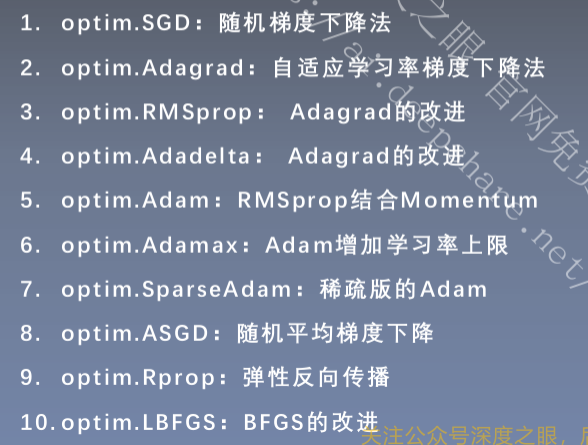

# exploring_data_driven
## 1. basic
### 1.1 [pytorch](https://yiyan.baidu.com/share/REMpDKUfCt)与线性回归问题
- pytorch特点
> [动态计算图](https://zhuanlan.zhihu.com/p/598760275) 
> [张量计算](https://blog.csdn.net/qq_42681787/article/details/129323096)  
>高效的gpu加速  
> [自动求导](https://blog.csdn.net/Xixo0628/article/details/112669929?spm=1001.2014.3001.5502)   广泛的预训练模型库   强大的线性代数支持  广泛的社区支持
- Tensor创建与操作
- 线性回归
### 1.2 workflow
#### 1.2.1 数据
- 数据集

|                            数据集                            |                             文件                             |                          benchmark                           |
| :----------------------------------------------------------: | :----------------------------------------------------------: | :----------------------------------------------------------: |
|          [MNIST](http://yann.lecun.com/exdb/mnist/)          |                                                              |                                                              |
| [FashinMNIST](https://github.com/zalandoresearch/fashion-mnist) |                                                              | [benchmark](https://paperswithcode.com/sota/image-classification-on-fashion-mnist) |
|    [Cifar10](https://www.cs.toronto.edu/~kriz/cifar.html)    |                                                              | [benchmark](https://paperswithcode.com/sota/image-classification-on-cifar-10) |
|         [COCO](https://cocodataset.org/#format-data)         |       [file](/home/renjie/renjie_ws/dataset/COCO2017)        | [benchmark](https://paperswithcode.com/sota/object-detection-on-coco) |
|      [kitti](https://paperswithcode.com/dataset/kitti)       |                                                              |                                                              |
|            [nuscenes](https://www.nuscenes.org/)             | [file](/home/renjie/renjie_ws/dataset/nuscenes/data/v1.0-mini) | [benchmark](https://paperswithcode.com/sota/3d-object-detection-on-nuscenes-camera-only) |

- [Dataset & Dataloader](https://yiyan.baidu.com/share/CBuUUXkDTU)
> 从库(`torchvision`,`torchaudio`,`torchtext`)中加载数据集 
> [自定义数据集](https://blog.csdn.net/qianbin3200896/article/details/119832583?spm=1001.2014.3001.5501#t9) 

- [transform](https://pytorch.org/tutorials/beginner/basics/transforms_tutorial.html)
> 数据清洗、标准化、归一化、填充缺失值、转换数据类型等 
> [图像常见transform](https://pytorch.org/vision/stable/transforms.html)

#### 1.2.2 模型
- [线性(linear)](https://pytorch.org/docs/stable/generated/torch.nn.Linear.html#torch.nn.Linear)

- [激活函数(activation)](https://pytorch.org/docs/stable/nn.html#non-linear-activations-weighted-sum-nonlinearity)
> [为什么要激活函数]( https://yiyan.baidu.com/share/ZCqwR1fAGj ) 
> [常见激活函数](https://zhuanlan.zhihu.com/p/352668984) 
> [什么是梯度消失与爆炸](https://zhuanlan.zhihu.com/p/483651927) 
> [什么是ICS](https://yiyan.baidu.com/share/GHpggdsBEy )

|  激活函数   |   输出值范围   |     导数值范围      |                 优点                  |               缺点                |
| :---------: | :------------: | :-----------------: | :-----------------------------------: | :-------------------------------: |
|  `sigmoid`  |     (0,1)      |      (0, 0.25)      |               符合概率                | 梯度消失  非0均值,破坏数据分布 |
|   `tanh`    |     (-1,1)     |       (0, 1)        |                 0均值                 |            易梯度消失             |
|   `ReLU`    |    (0,inf)     |  0 x<=0;  1 x>0  |            计算速度块              |    0处不可微 ; 神经元"死亡"    |
| `LeakyReLU` | (-eps*inf,inf) | eps x<=0;  1 x>0 | 避免梯度方向锯齿问题,参数更新更加平滑 |                                   |
|   `PReLU`   |  (-P*inf,inf)  |  P x<=0;  1 x>0  |                                       |                                   |
|   `RReLU`   |                |                     |                                       |                                   |

- [归一化(Normalization)](https://pytorch.org/docs/stable/nn.html#normalization-layers)
> [常见归一化层](https://blog.csdn.net/weixin_43570470/article/details/124043037) 
> [归一化通俗理解]( https://yiyan.baidu.com/share/IybijX30zX)  
> **batch_norm**  **layer_norm** instance_norm group_norm

- [池化层(pooling)](https://pytorch.org/docs/stable/nn.html#pooling-layers)
> [常见池化层图示](https://zhuanlan.zhihu.com/p/77040467) 
> [池化层通俗理解]( https://yiyan.baidu.com/share/9GywU6CZXG)

- [dropout](https://pytorch.org/docs/stable/generated/torch.nn.Dropout.html#torch.nn.Dropout)
> [dropout图示](https://zhuanlan.zhihu.com/p/390990848?utm_id=0) 
> [将dropout理解为集成学习]( https://yiyan.baidu.com/share/63qP4PxYQ0 )

- [卷积(convolution)](https://pytorch.org/docs/stable/nn.html#convolution-layers)
> [普通卷积图示](https://blog.csdn.net/m0_47005029/article/details/129270974) 
> [各式卷积](https://blog.51cto.com/u_14439393/5945930) [各式卷积](https://blog.csdn.net/m0_62919535/article/details/131317667?spm=1001.2101.3001.6650.3&utm_medium=distribute.pc_relevant.none-task-blog-2%7Edefault%7ECTRLIST%7ERate-3-131317667-blog-129270974.235%5Ev38%5Epc_relevant_anti_t3&depth_1-utm_source=distribute.pc_relevant.none-task-blog-2%7Edefault%7ECTRLIST%7ERate-3-131317667-blog-129270974.235%5Ev38%5Epc_relevant_anti_t3&utm_relevant_index=6) 
> 怎么实现高效卷积计算 
> [分组卷积,深度卷积,深度可分离卷积3D动画](https://www.bilibili.com/video/BV12h4y1s7RY/?spm_id_from=333.337.search-card.all.click)

- [Attention](https://pytorch.org/docs/stable/generated/torch.nn.MultiheadAttention.html#torch.nn.MultiheadAttention)
> [单头注意力](https://u5rpni.axshare.com/?id=q3erh9&p=self-attention&g=1&sc=3) 
> [多头注意力](https://u5rpni.axshare.com/?id=4ak987&p=multi-head-attention&g=1&sc=3) 

- [Transformer](https://zhuanlan.zhihu.com/p/114497616) 
 Transfomer就是带有attention机制的一种encoder-decoder模型

- 可形变机制
> [deformable 卷积](https://zhuanlan.zhihu.com/p/138020203) 
> [deformable attention](https://blog.csdn.net/charles_zhang_/article/details/127934444)

#### 1.2.3 [损失函数](https://zhuanlan.zhihu.com/p/603339901)
衡量模型输出与真实标签的差距
> [api接口](https://pytorch.org/docs/stable/nn.html#loss-functions) 
> 信息量 熵 相对熵(KL散度) 交叉熵  
> 交叉熵损失函数 二分类损失函数 L1Loss  MSELoss

#### 1.2.4 优化器
管理并更新模型中的可学习的参数,使得loss减小
> [梯度下降](https://zhuanlan.zhihu.com/p/113714840?ivk_sa=1024320u&utm_id=0) 
> [随机梯度下降](https://github.com/MathFoundationRL/Book-Mathmatical-Foundation-of-Reinforcement-Learning/blob/main/3%20-%20Chapter%206%20Stochastic%20Approximation.pdf) 
> [常用优化算法](https://zhuanlan.zhihu.com/p/658973246?utm_id=0) 

#### 1.2.4 训练迭代,加载,保存和可视化
> [saving & loading](https://pytorch.org/tutorials/beginner/basics/saveloadrun_tutorial.html) 
> [CAPTUM](https://pytorch.org/tutorials/recipes/recipes/Captum_Recipe.html) 
> [可视化工具 tensorboard](https://pytorch.org/tutorials/recipes/recipes/tensorboard_with_pytorch.html) 

#### 性能优化与部署
> [量化(QUantization)](https://pytorch.org/tutorials/recipes/recipes/dynamic_quantization.html) 模型量化是一种将深度学习模型中的浮点数参数和计算操作转换为定点数参数和计算操作的过程。这种技术可以有效地**降低模型计算强度、参数大小和内存消耗**，但往往带来巨大的精度损失。在深度学习中，模型量化主要用于神经网络的训练和部署阶段

### 1.3 [quickstart](https://pytorch.org/tutorials/beginner/basics/quickstart_tutorial.html)

## 2. 分类任务
- [ImageNet](https://paperswithcode.com/sota/image-classification-on-imagenet)
- [卷积网络](https://blog.csdn.net/weixin_45897172/article/details/128330887)
> LeNet  
> AlexNet  
> VGG  
> GoogLeNet  
> [ResNet](https://blog.csdn.net/daweq/article/details/127540449)  
> [mobilenet](https://blog.csdn.net/ManiacLook/article/details/123230896)

- transformer网络
> [ViT](https://arxiv.org/pdf/2010.11929.pdf) ([file](/home/renjie/Desktop/paper/self-attention/\(VIT) An Image is Worth 16x16 Words, Transformers for Image Recognition at Scale.pdf)) 
> Swin ([file](/home/renjie/Desktop/paper/self-attention/\(Swin Transformer): Hierarchical Vision Transformer using Shifted Windows.pdf))

## 3. 目标检测、语义分割和实例分割
- [Anchor-based 和 anchor-free](https://blog.csdn.net/m0_61899108/article/details/122893551)
- 单阶段与多阶段
- [直接集合预测](https://yiyan.baidu.com/share/8qcVepAmC2)
- [Metrics](https://blog.csdn.net/qq_38375203/article/details/125391658)
- [Faster RCNN](https://zhuanlan.zhihu.com/p/383167028)
> BoxCoder
> Anchor
> 正负样本均衡sampler
> [非极大值抑制 NMS](https://zhuanlan.zhihu.com/p/587225859)

- [DETR](https://arxiv.org/pdf/2005.12872.pdf)

## 4. Lidar感知与预测模型

## 5. BEV

## 6. PNC和E-E探索